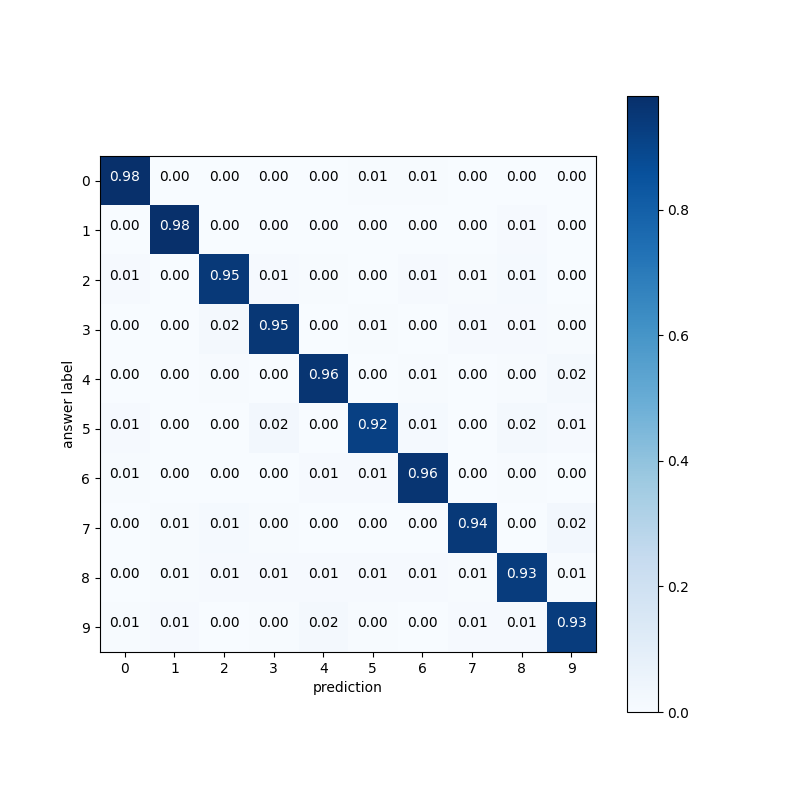
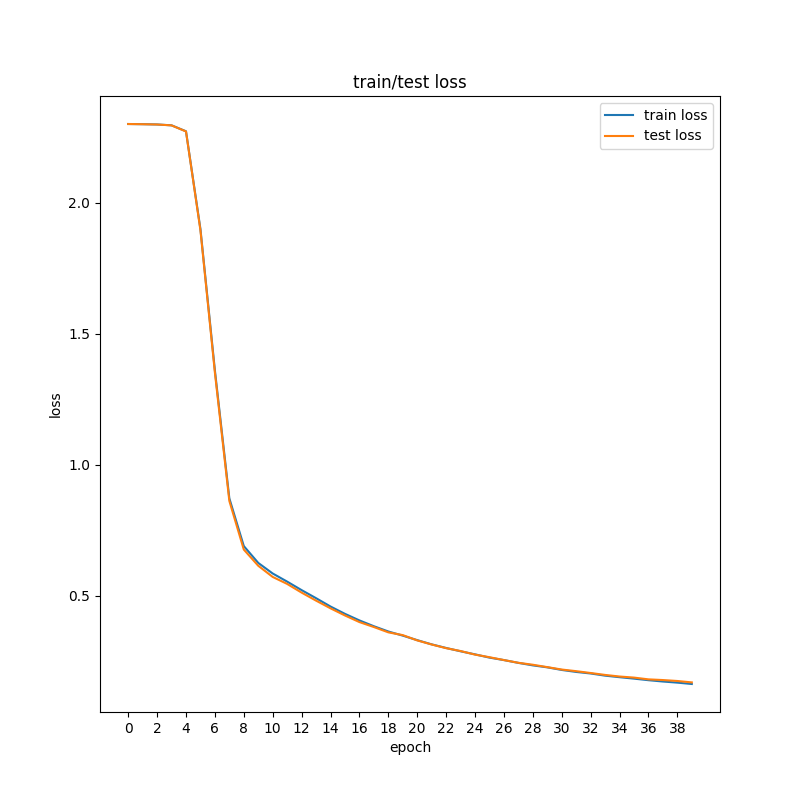
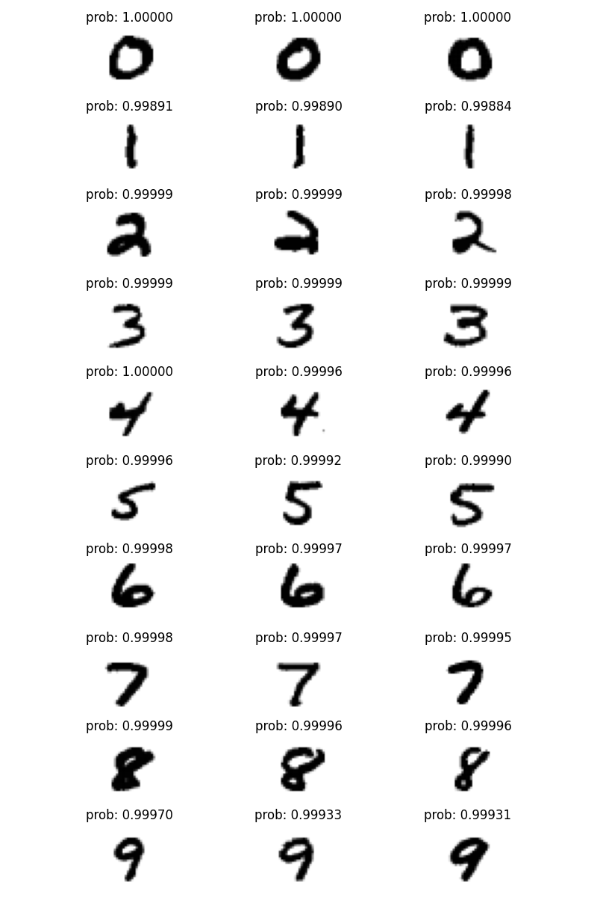

# 2024 DGIST "CSE303 Introduction to Deep Learning" Programming Assignment 1

## Objective : 
- Implement 3-layer Neural Network for Classification
  - without deep learning framework
  - using deep learning framework
- Implement 3-layer Convolution Neural Network for Classification
  - without deep learning framework
  - using deep learning framework

## What is implemented

- `only_python`: codes without deep learning framework
  - [PA1_only_python_functions.py](./PA1_only_python_functions.py)
  - [PA1_only_python_layers.py](./PA1_only_python_layers.py)
  - [PA1_only_python_net.py](./PA1_only_python_net.py)
  - [PA1_only_python_trainer.py](./PA1_only_python_trainer.py)
- `pytorch`: codes using PyTorch
  - [PA1_pytorch_net.py](./PA1_pytorch_net.py)
  - [PA1_pytorch_trainer.py](./PA1_pytorch_trainer.py)

Networks do MNIST dataset classification. Trainers return confusion matrix, loss change graph by epoch, top-three images.

**Confusion matrix example**



**Loss change graph by epoch example**



**Top-three images example**



## How to use

First, move working directory to `PA1`

```bash
cd PA1
```

If you want to see the result of `only_python`, run this

```bash
python3 PA1_only_python_trainer.py
```

If you want to see the result of `pytorch`, run this

```bash
python3 PA1_pytorch_trainer.py
```

Results are saved in plot_results.